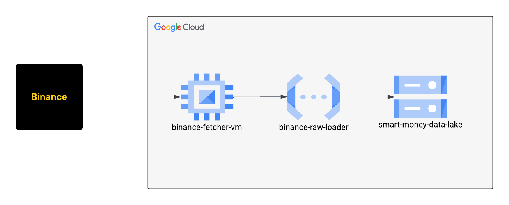

# Smart Money Raw Layer – Binance Streamer

This project collects real-time and historical Kline (candlestick) data from Binance and stores it in a Google Cloud Storage-based raw data lake.



# VM: Binance Streamer

This Google Cloud VM (`e2-micro`) streams live Binance Kline (candlestick) data and forwards it to a Google Cloud Function in real time. It also includes a manual backfill script to recover missing historical data.

> **Why a VM?** Binance blocks IP addresses associated with GCP Cloud Functions. A persistent VM avoids this issue.

---

## Project Structure

| Path | Description |
|------|-------------|
| `raw/vm_instances/startup.sh` | Startup script: installs Python, sets up dependencies, downloads Python scripts, and launches the streaming service |
| `raw/vm_instances/binance_kline_streamer.py` | Streams live Kline data from Binance WebSocket API and sends it to a Cloud Function |
| `raw/vm_instances/backfill_klines.py` | Script to backfill historical data manually via Binance REST API |
| `raw/vm_instances/deploy.sh` | Automates creation and configuration of the VM using `gcloud` |
| `raw/cloud_function/main.py` | Cloud Function: receives Kline data and stores it in Cloud Storage as newline-delimited JSON (`.jsonl`) |
| `raw/cloud_function/requirements.txt` | Python dependencies for the Cloud Function |
| `raw/cloud_function/deploy.sh` | Deploys the Cloud Function using `gcloud` |

---

## How It Works

### On VM Boot (`startup.sh`)
- Installs Python 3 and pip
- Installs required packages: `requests`, `websockets`
- Downloads Python scripts from instance metadata
- Registers and starts the `binance_kline_streamer.py` as a `systemd` service

### Real-time Streaming (`binance_kline_streamer.py`)
- Runs continuously in the background
- Streams live Kline data (1h interval) from Binance WebSocket
- Sends each completed Kline to a Cloud Function
- Automatically restarts on failure or VM reboot

### Manual Backfill (`backfill_klines.py`)
- Run manually via SSH:
  ```bash
  python3 /opt/binance/backfill_klines.py
- Fetches up to 30 days of historical data using Binance's REST API
- Sends deduplicated Klines to the same Cloud Function

### Cloud Function (main.py)
- Receives data from either live stream (kline) or backfill (klines)
- Stores data in GCS under:
gs://BUCKET_NAME/raw/binance_btcusdc_1h.jsonl
- Backfill is merged with existing data and deduplicated using open_time
- Streaming data is appended via blob composition


## Deployment Overview
VM Creation:
Use deploy.sh in raw/vm_instances/ to create and configure the VM.

Cloud Function Deployment:
Use deploy.sh in raw/cloud_function/ to deploy the function with appropriate IAM and bucket access.

Bucket Layout:
Raw data is stored in:
gs://BUCKET_NAME/raw/binance_btcusdc_1h.jsonl
